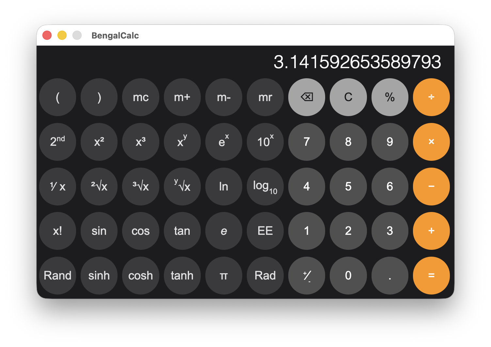
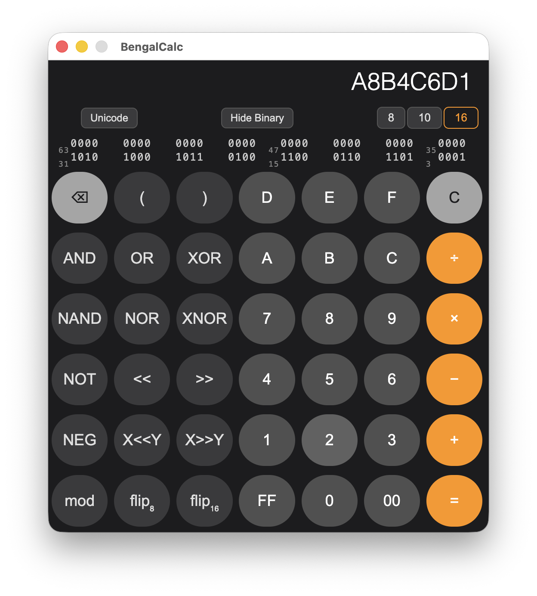
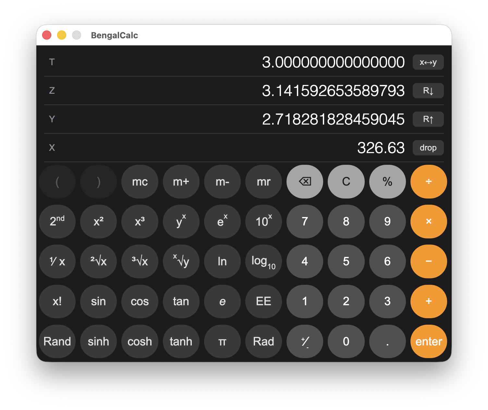

# BengalCalc v1.1.0

A cross-platform scientific and programmer calculator built with Electron, supporting both algebraic and RPN entry modes.

*by Richard Lesh*

---

## Features

### Calculator Modes

**Algebraic Mode** — Standard infix expression entry with parentheses and operator precedence.

**RPN Mode** — Classic 4-level stack (T, Z, Y, X) with Enter to push, stack lift on new input after operations, and full stack manipulation (swap, roll up, roll down, drop).

### Scientific Layout



- **2nd** (alt/option key) toggles alternate functions: sin⁻¹, cos⁻¹, tan⁻¹, sinh⁻¹, cosh⁻¹, tanh⁻¹, log₂, 2ˣ, logᵧ, xʸ
- **Rad/Deg** toggles angle mode for trigonometric functions
- **EE** enters scientific notation exponent

### Programmer Layout



- **Base switching**: 8 (octal), 10 (decimal), 16 (hexadecimal)
- **Binary display**: 64-bit binary view with nibble grouping (toggle show/hide)
- **ASCII/Unicode** toggle buttons
- Digits ≥ base are automatically disabled
- **Alt/Option key** toggles second functions RoL RoR, X RoL Y, X RoR Y

### Bitwise Operations

| Operation | Description |
|-----------|-------------|
| AND | Bitwise AND |
| OR | Bitwise OR |
| XOR | Bitwise exclusive OR |
| NAND | Bitwise NAND (NOT AND) |
| NOR | Bitwise NOR (NOT OR) |
| XNOR | Bitwise XNOR (NOT XOR) |
| NOT | Bitwise complement |
| NEG | Two's complement negation |
| << / >> | Shift left/right by 1 |
| X<<Y / X>>Y | Shift left/right by Y bits |
| RoL / RoR | Rotate left/right (64-bit) |
| mod | Modulo |
| flip₈ | Byte-reverse (8-bit) |
| flip₁₆ | Word-reverse (16-bit) |
| 00 | Append 0x00 to input |
| FF | Append 0xFF to input |

### Display Formats (File → Display)

| Format | Description |
|--------|-------------|
| Auto | Shortest representation (like `%g`) |
| Fixed | Fixed-point (like `%f`) |
| Scientific | Scientific notation (like `%e`) |
| Engineering | Scientific with exponents as multiples of 3 |

### Precision (File → Precision)

Select 0–15 decimal places. Applies to Fixed, Scientific, and Engineering formats. In Auto mode, precision controls significant digits when set.

### RPN Stack Behavior



- **Enter**: Pushes current value onto stack (duplicates X into Y)
- **Stack lift**: After operations, typing a new number lifts the stack (previous result moves to Y)
- **After Enter**: Stack lift disabled — next typed number replaces X without lifting
- **C**: Clears X only; button changes to **AC** to clear entire stack
- **x↔y**: Swap X and Y registers
- **R↓**: Roll stack down (X → T, T → Z, Z → Y, Y → X)
- **R↑**: Roll stack up (T → X, X → Y, Y → Z, Z → T)
- **drop**: Remove X, shift stack down, T fills with 0

### Keyboard Shortcuts

| Key | Action |
|-----|--------|
| 0–9 | Digit entry |
| . | Decimal point |
| + - * / | Arithmetic operators |
| Enter or = | Evaluate / Enter (RPN) |
| Backspace | Delete last digit |
| Escape | Clear |
| ( ) | Parentheses (algebraic only) |
| A–F | Hex digits (programmer, base 16) |

---

## Menu Options

### File Menu

- **Mode**: Algebraic / RPN
- **Layout**: Scientific / Programmer
- **Precision**: 0–15 decimal places
- **Display**: Auto / Fixed / Scientific / Engineering

---

## Installation

### Prerequisites
- [Node.js](https://nodejs.org) (v18 or later)
- npm

### Setup
```bash
git clone https://github.com/richlesh/BengalCalc.git
cd BengalCalc
npm install
```

### Running
```bash
npm start
```

---

## Building Distribution Packages

```bash
# All platforms and architectures
npm run dist:all

# Individual builds
npm run dist:mac:x64       # macOS Intel
npm run dist:mac:arm64     # macOS Apple Silicon
npm run dist:win:x64       # Windows x64
npm run dist:win:arm64     # Windows ARM64
npm run dist:linux:x64     # Linux x64
npm run dist:linux:arm64   # Linux ARM64
```

Output files are placed in the `dist/` folder.

---

## Project Structure

```
BengalCalc/
├── main.js              # Electron main process
├── calc-engine.js       # Calculator engine (RPN + algebraic)
├── index.html           # Main calculator window
├── styles.css           # Calculator styles
├── settings.html        # Settings window
├── settings.js          # Settings module (load/save)
├── about.html           # About dialog
├── license_dialog.html  # License key entry
├── splash.html          # Splash screen
├── config.json          # App configuration
├── package.json         # npm/electron-builder config
├── app_icon.png/.icns/.ico  # App icons
├── sign-mac.sh          # macOS code signing script
└── .github/workflows/   # CI/CD workflows
```

---

## License Key

Generate a license key for a user:
```bash
python3 generate_license_key.py user@example.com
```

---

## Tech Stack

- [Electron](https://www.electronjs.org)

---

## License

GPL 3.0
